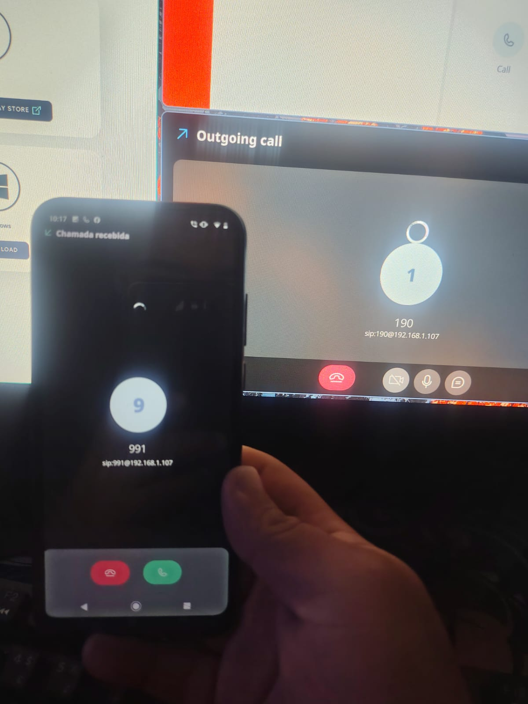
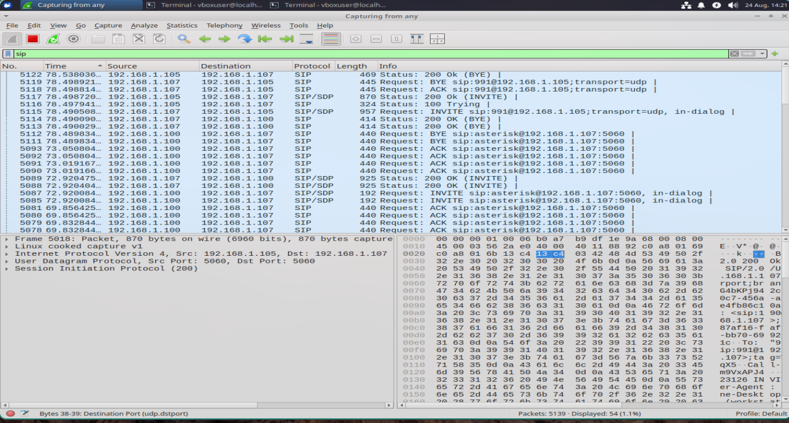

Fui chamado para uma entrevista de estágio em uma empresa de telecomunicações. A vaga exigia conhecimentos prévios com **3CX**, **SNEP**, **Wireshark** e protocolo **SIP**. Dos citados, eu só conhecia o Wireshark, e tinha 3 dias pra estudar. Fui pra cima com tudo pra tentar entender a fundo como isso tudo funcionava.

Li bastante, dediquei meus dias somente a isso pra ir preparado pra entrevista.

No momento que eu estava arrumado e pronto pra sair, recebi uma mensagem dizendo que tiveram imprevistos e teriam que remarcar, posteriormente disseram que cancelaram a vaga 🤡.

Mas é aquilo, se a vida te der limões faça uma caipirinha.

---

## O que é SNEP?

A vaga pedia SNEP, mas oque é isso afinal??? eu nunca tinha ouvido falar..mas depois de pesquisar muito descobri que basicamente o SNEP é uma interface em php que vai funcionar encima do asterisk.

ja o asterisk é a base, o servidor que vai receber encaminhar e registrar todas as nossas chamadas na nossa super estação de telefonia. 
o snep foi criado pra facilitar a instalação e configuração, deixar mais intuitiva e pratica ja que tem interface grafica.

eu escolhi o asterisk pro lab justamente por ser a base do SNEP, a minha lógica é, se eu entender a base o resto é suave, sempre foi minha forma de pensar a respeito das coisas e é só assim que o conhecimento fixa na minha cabeça.

---

## A topologia do lab

essa foi a minha "infra" 

```
┌─────────────────────────────────────────────────────┐
│                  Rede Local (LAN)                   │
│                                                     │
│  ┌──────────────────────────────────┐               │
│  │   VM Ubuntu (VirtualBox - Bridge)                │
│  │   Asterisk PBX                                   │
│  │   Ramal 190 e 991 registrados                    │
│  └──────────┬───────────────────────┘               │
│             │ SIP                                   │
│     ┌───────┴────────┐                              │
│     │                │                              │
│  ┌──┴───┐        ┌───┴───┐                          │
│  │ Host │        │Celular│                          │
│  │Linphone        Linphone                          │
│  │Ramal 991       Ramal 190                         │
│  └──────┘        └─────────┘                        │
└─────────────────────────────────────────────────────┘
```

- **VM Ubuntu** rodando o asterisk com a placa de rede em **bridge** para que o servidor seja acessivel na rede local 
- **Linphone** é um software que simula um telefone, tem teclado de discagem e etc, para configurar ele voce precisa conectar em um pbx, no caso será nosso asterisk.
no host (ramal 991) e no celular (ramal 190), ambos na mesma rede


---

## Instalação do Asterisk

```bash
sudo apt update -y
sudo apt install asterisk -y
```

Confirma que o serviço subiu:

```bash
sudo systemctl status asterisk
sudo asterisk -rvvv
```

---

## Configuração dos ramais

O Asterisk usa arquivos de configuração em `/etc/asterisk/`. Os dois principais que editei foram o `pjsip.conf`
enquanto eu estava pesquisando sobre eu pensei no pjsip.conf como uma especie de lista de usuarios, claro que não é só isso, mas é aqui que ficam armazenadas login e senha.

### /etc/asterisk/pjsip.conf

```ini
[190]
type=endpoint
context=interno
auth=190
aors=190

[190]
type=auth
auth_type=userpass
username=190
password=senha190

[190]
type=aor
max_contacts=1


[991]
type=endpoint
context=interno
auth=991
aors=991

[991]
type=auth
auth_type=userpass
username=991
password=senha991

[991]
type=aor
max_contacts=1
```

### /etc/asterisk/extensions.conf

  e o  `extensions.conf` seria a logica, como essas ligações serão feitas, qual o comportamento esperado? oque o asterisk deve fazer quando alguem discar 190? pra quem encaminhar? por quanto tempo deve tocar? ele deve tocar uma mensagem gravada??.

```ini
[interno]
exten => 190,1,Dial(PJSIP/190) //se alguem discar 190, o asterisk vai encaminhar a ligação para o ramal 190
exten => 991,1,Dial(PJSIP/991) // mesma coisa porem pro 991
```

Depois de editar, recarrega as configurações sem derrubar o serviço:

```bash
sudo asterisk -rvvv
# dentro do console do asterisk:
pjsip reload
dialplan reload
```

---

## Registrando os ramais no Linphone

Ja fizemos a parte mais dificil, agora e só logar nos usuarios que registramos no pjsip.conf, com as credenciais que cadastramos lá.

- **Domínio/Servidor SIP**: 192.168.1.107
- **Usuário**: `190` ou `991`
- **Senha**: a definida no `pjsip.conf`
- **Porta**: 5060 (padrão SIP)
- **Transporte**: UDP

Configuração no celular (ramal 190):


Fiz o mesmo no host (ramal 991), mudando apenas as credenciais — login e senha correspondentes ao ramal 991.

Com os dois ramais registrados, a chamada funcionou:



EXTREMAMENTE SATISFATORIO KKKKK, e funciona super bem, baixa latencia, zero ruido.(talvez por ser rede local né..)

---

## Analisando o tráfego com Wireshark

Com tudo funcionando, abri o Wireshark no host para capturar o tráfego SIP entre os dispositivos.

```bash
sudo wireshark
```

Filtro usado:

```
sip
```



não precisa ser um genio pra saber que eles usam o wireshark pra debugging. 
O protocolo sip é de sinalização, ele serve justamente pra comunicar o estado da ligação, se o telefone está tocando, se a ligação foi atendida, se é hora de chamar o rtp pra transmitir MIDIA , seja audio ou video ou se é hora de encerrar a chamada .É relativamente simples de entender e uma das partes mais divertidas do projeto foi monitorar os pacotes em tempo real.

---

## Considerações Finais

 
Infelizmente a entrevista não rolou,uma pena pq eu adoraria trabalhar com isso ,mas rendeu um post legal aqui no blog.

Foi divertido.

---


